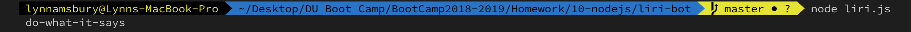

# liri-bot

## Overview:

Liri-bot is a command line interface (CLI) app created in Node.js that takes in user input (performersnode, songs, and movie titles) as parameters and returns information about each of those inputs.

## How to Install:
Open terminal or git bash and clone the repository to the directory of your choice.
Enter ` npm install ` or ` npm i ` to install the node packages needed to run the app (axios, dotenv, moment, node-spotify-api).
**Note:** A local .env file containing the Spotify API id and secret will be needed. A Spotify id and secret can be obtained [here](https://developer.spotify.com/).

## Specifications:

### liri-bot takes in the following commands:
concert-this
spotify-this-song
movie-this
do-what-it-says

## What Each Command Does:

### concert-this:
Type ` node liri.js concert-this <artist/band name> ` into the command line.

This will search the Bands in Town Artist Events API ("https://rest.bandsintown.com/artists/" + artist + "/events?app_id=codingbootcamp") for an artist and render the following information about each event to the terminal:
Name of the venue
Venue location
Date of the Event (use moment to format this as "MM/DD/YYYY")

### spotify-this-song:
Type ` node liri.js spotify-this-song <song name> ` into the command line.

This will show the following information about the song in your terminal/bash window:
Artist(s)
The song's name
A preview link of the song from Spotify
The album that the song is from

If no song name is provided then the program will default to "The Sign."

### movie-this:
Type ` node liri.js movie-this <movie name> ` into the command line.

This will output the following information to your terminal/bash window:
Title of the movie
Rating of the movie
Year the movie came out
IMDB Rating of the movie
Rotten Tomatoes Rating of the movie
Country where the movie was produced
Language of the movie
Plot of the movie
Actors in the movie

If the user doesn't type a movie name in, the program will output data for the movie 'Mr. Nobody.'

### do-what-it-says:
Type ` node liri.js do-what-it-says ` into the command line.

Using the fs Node package, LIRI will take the text inside of a text file named random.txt and then use it to call one of LIRI's commands.

It should run spotify-this-song for "I Want it That Way," as follows the text in random.txt. Users can edit the text in random.txt to test out the feature for movie-this and concert-this.